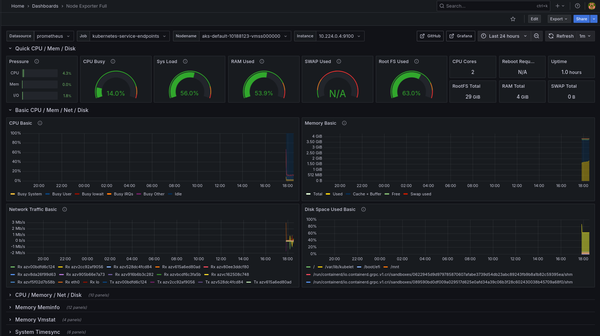

# DevOps Lab Stack 🚀

A complete, production-like DevOps project for local deployment, integrating:

- ⚙️ CI/CD with Jenkins
- ☁️ Infrastructure as Code with Terraform
- 📦 Configuration Management with Ansible
- 🐳 Container orchestration with Kubernetes (Minikube/k3d)
- 📈 Monitoring with Prometheus & Grafana
- 📄 Logging with ELK Stack (Elasticsearch, Logstash, Kibana)
- 📊 Helm for K8s packaging and deployment

> This repository serves as a portfolio project to demonstrate end-to-end DevOps skills using industry-standard tools.

---

## 🧱 Stack Overview

| Layer         | Tools Used                                         |
|---------------|----------------------------------------------------|
| CI/CD         | Jenkins (pipeline with Docker & Helm deployment)   |
| Provisioning  | Terraform (to setup cluster or infra)              |
| Configuration | Ansible (install Docker, Kubernetes, Jenkins, etc.)|
| Orchestration | Kubernetes (Minikube / k3d)                        |
| Packaging     | Helm (custom chart for app deployment)            |
| Monitoring    | Prometheus, Grafana                                |
| Logging       | ELK Stack (Elasticsearch, Logstash, Kibana)        |

---

## 📊 Grafana Dashboard

