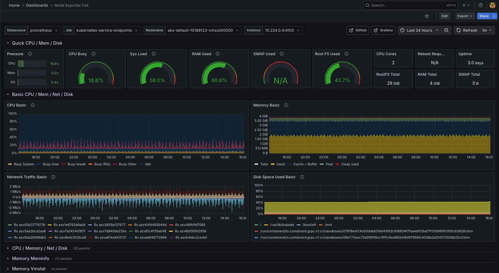

# DevOps Lab Stack: AKS Logging Pipeline with Filebeat, Elasticsearch, and Kibana

## 📌 Project Overview

This project sets up a basic logging stack on Azure Kubernetes Service (AKS), using:
- **Filebeat** to collect logs from Kubernetes pods
- **Elasticsearch** to index and store the logs
- **Kibana** to visualize logs via dashboards

All infrastructure is provisioned using **Terraform**, and deployments are managed via **Helm** within a Jenkins CI/CD pipeline.

---

## 🛠️ Stack Components

| Component      | Purpose                                      |
|----------------|----------------------------------------------|
| Azure AKS      | Kubernetes cluster hosting the applications  |
| Terraform      | Infrastructure provisioning                  |
| Jenkins        | CI/CD pipeline automation                    |
| Helm           | Kubernetes app deployment manager            |
| Filebeat       | Lightweight log shipper for Kubernetes logs  |
| Elasticsearch  | Log indexing and search                      |
| Kibana         | Log visualization dashboard                  |
| Prometheus	 | Collects metrics from Kubernetes and services|
| Grafana	 | Dashboards for visualizing Prometheus metrics|

---

## ✅ CI/CD Pipeline Stages

The pipeline (defined in `Jenkinsfile`) includes the following stages:

1. **Checkout Source Code**
2. **Login to Azure with Service Principal**
3. **Terraform Init & Apply** (provisions AKS)
4. **Get AKS Credentials**
5. **Clean Old Kibana Resources**
6. **Deploy Applications with Helm**
7. **Retrieve Elasticsearch Credentials**
8. **Test Elasticsearch Connectivity**

---

## 📊 Log Flow Architecture

```text
[ Kubernetes Pods ]
       │
       ▼
[ Filebeat DaemonSet ]
       │
       ▼
[ Elasticsearch ]
       │
       ▼
[ Kibana Dashboards ]
```
---

## 🚀 How to Run the Project
Set up Jenkins credentials for:

* `azure-subscription-id`
* `azure-client-id`
* `azure-client-secret`
* `azure-tenant-id`

*2. Trigger the Jenkins pipeline*

*3. Access Kibana:*

* Get Kibana's public IP:
```bash
kubectl get svc -n logging
```
* Open `http://<kibana-ip>:5601` in your browser

---
## 🌐 Accessing the Applications
Some services deployed in the cluster (like Kibana, Elasticsearch, Prometheus, and Grafana) are exposed internally or via LoadBalancer, depending on configuration. If LoadBalancer is not available (e.g. on Azure Free Tier), you can use port forwarding to access them locally.

### 🔍 Access Kibana
```bash
kubectl port-forward svc/kibana-kibana 5601:5601 -n logging
```
Then open http://localhost:5601 in your browser.

### 🔎 Access Elasticsearch
```bash
kubectl port-forward svc/elasticsearch-master 9200:9200 -n logging
```
You can then query it with:
```bash
curl -u elastic:<your_password> http://localhost:9200
```

### 📈 Access Prometheus
```bash
kubectl port-forward svc/prometheus-server 9090:9090 -n monitoring
```
Go to http://localhost:9090

### 📊 Access Grafana
```bash
kubectl port-forward svc/grafana 3000:3000 -n monitoring
```
Then open http://localhost:3000 and log in with:
* Username: `admin`
* Password: `admin`

---

## 📊 Grafana Dashboard



## 📊 ELK Dashboard


---

## ⚠️  Notes

* This project no longer includes Kafka & Logstash due to Azure Free Tier limitations.
* All components are deployed with minimum resources to stay within quotas.
* Do not use this stack as-is for production — it lacks security hardening and scaling.
